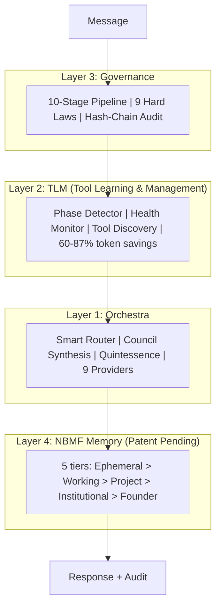

<p align="center">
  <br/>
  <a href="https://mas-ai.co">
    
  </a>
  <br/>
  <br/>
</p>

<h1 align="center">
  
</h1>

<h3 align="center">The First AI Vice President</h3>

<p align="center">
  <sub>Governed Multi-Agent Orchestration Platform</sub><br/>
  <sub>10 departments &bull; 60 agents &bull; 133 skills &bull; 9 LLM providers &bull; 3 patents pending</sub>
</p>

<br/>

<p align="center">
  <a href="#-get-started"></a>
  &nbsp;
  <a href="#-how-it-works"></a>
  &nbsp;
  <a href="#-free-vs-pro"></a>
  &nbsp;
  <a href="https://www.youtube.com/watch?v=oST1aJYdEBs"></a>
  &nbsp;
  <a href="mailto:daena@mas-ai.co"></a>
</p>

<p align="center">
  
  
  
  
  
  
  
</p>

<br/>

<p align="center">
  <a href="https://www.youtube.com/watch?v=oST1aJYdEBs">
    
  </a>
</p>

<br/>

<p align="center">
  
</p>

<p align="center">
  
  &nbsp;&nbsp;
  
</p>

<br/>

<p align="center">
  <strong>One platform. Every AI model. Every tool. Governed.</strong><br/>
  <sub>Install Claude Code, Codex, Gemini CLI, or OpenClaw on Daena.<br/>
  Add Ollama for free local AI. <strong>Your data stays on your machine. Always.</strong></sub>
</p>

<br/>

---

## Install your tools. Daena runs them all.

<p align="center">
  
  &nbsp;
  
  &nbsp;
  
  &nbsp;
  
</p>

<p align="center">
  
  
  
  
  
</p>

Every MCP server, plugin, and skill that works with Claude Code or Codex **already works with Daena**. Nothing to migrate.

Access from your phone via [Chrome Remote Desktop](https://remotedesktop.google.com) -- full access to your computer, upload/download files, not just chat. No mobile app needed.

---

##  Free vs Pro

<table>
<tr>
<td align="center" width="50%">

### Free Forever

**Full platform. $0.**

Install Daena + your own tools.
Use your Claude, OpenAI, or Google subscriptions.
Add Ollama for unlimited free local AI.

**Every feature. Every agent. Every department.
Your tools. Your data. Your machine.**

</td>
<td align="center" width="50%">

### Daena Pro

**All LLMs included. One price.**

Claude 4.6 + GPT-5.4 + Gemini 3 Pro
\+ Codex 3 + Groq + Perplexity
All included. No API keys needed.

**Instead of $200 + $200 + $200 = $600/mo,
pay $29-99/mo for everything.**

</td>
</tr>
</table>

> **Same platform. Same features. Same 60 agents.** Free = bring your own LLMs. Pro = we provide them all.

<details>
<summary><strong>See pricing vs competitors</strong> (verified March 2026)</summary>
<br/>

| | Perplexity | ChatGPT Pro | Claude Max | Manus | **Daena Free** | **Daena Pro** |
|:--|:---:|:---:|:---:|:---:|:---:|:---:|
| **Price** | $200/mo | $200/mo | $200/mo | $39-200/mo | **$0** | **$29-99/mo** |
| **Claude 4.6** | No | No | Yes | No | Bring yours | **Included** |
| **GPT-5.4** | Limited | Yes | No | No | Bring yours | **Included** |
| **Gemini 3 Pro** | No | No | No | No | Bring yours | **Included** |
| **Free local AI** | No | No | No | No | **Ollama** | **Ollama** |
| **Install Claude Code** | No | No | N/A | No | **Yes** | **Yes** |
| **All MCP + plugins** | No | No | Some | No | **Yes** | **Yes** |
| **10-stage governance** | No | No | No | No | **Yes** | **Yes** |
| **60 agents** | No | No | No | No | **Yes** | **Yes** |
| **Works offline** | No | No | No | No | **Yes** | **Yes** |
| **Source available** | No | No | No | No | **BSL 1.1** | **BSL 1.1** |

</details>

---

## >-How_It_Works-2DD4BF?style=flat-square&logoColor=black" /> How It Works

Every message passes through a **10-stage governed pipeline**:

```
Security > Session > Intent > Governance > Cost > Router > Memory > Build > Stream > Audit
```

| What matters | How Daena handles it | Impact |
|:-------------|:--------------------|:------:|
| **"Hello" costs the same as complex reasoning?** | Smart routing: greetings go to free Ollama, hard problems go to Claude | **50-100% savings** |
| **All 20+ tool schemas loaded every turn?** | TLM Phase Detection: loads only active tools per turn | **60-87% tokens saved** |
| **No approval flow for dangerous actions?** | Governance catches risky actions before tokens are spent | **Prevents waste** |
| **Context lost between sessions?** | NBMF 5-tier memory persists and learns | **Fewer re-explanations** |

**Total pipeline overhead: under 25ms.** Governance is invisible for routine tasks, visible only when it matters.

<details>
<summary><strong>Architecture diagram</strong></summary>
<br/>



</details>

<details>
<summary><strong>All features</strong></summary>
<br/>

- **Multi-Runtime**: 9 providers. Set Primary Mind to choose which leads. Others become fallbacks.
- **TLM**: Phase Detector analyzes each message (<0.1ms, zero LLM cost). 100-turn session: 420K tokens baseline vs 52K with TLM.
- **Council + Quintessence**: 3 models analyze independently. Quintessence adds 55 expert lenses.
- **10 Departments**: Engineering, Product, Marketing, Sales, Finance, Operations, Research, Legal, Skill Governance, Security.
- **NBMF Memory**: 5 trust-gated tiers. Hallucinations auto-expire. SHA-256 dedup.
- **DaenaBot**: FileAgent, TerminalAgent, BrowserAgent, MCPAgent. All governed.
- **Skill Refinery**: Self-improving agents. 3-pass pipeline: gap finder, improver, critic.
- **40+ Connectors**: Gmail, Slack, Notion, GitHub, Figma, Jira, HubSpot, Salesforce, Stripe, and more. One-click setup.
- **Mobile**: Built-in API + Chrome Remote Desktop for full phone access (upload, download, everything).

</details>

---

## >-Security-2DD4BF?style=flat-square&logoColor=black" /> Security

<p align="center">
  
  &nbsp;
  
  &nbsp;
  
</p>

| | Daena | OpenClaw | Others |
|:--|:---:|:---:|:---:|
| Auth on every endpoint | **JWT required** | [CVE-2026-25253](https://www.oasis.security/blog/openclaw-vulnerability) (17.5K exposed) | N/A |
| Network binding | **Loopback only** | 0.0.0.0 (exposed) | Cloud |
| Approval gates | **Tier 0-4** | None | None |
| Immutable laws | **9 hardcoded** | None | None |
| Audit trail | **Hash-chain** | None | None |
| Ports | **Configurable via env** | Hardcoded | N/A |

<details>
<summary><strong>The 9 Hard Laws</strong></summary>
<br/>

1. No live trading without human activation
2. No unsupervised financial actions
3. No unbounded execution (every operation has a timeout)
4. Founder bypass is logged, not hidden
5. No data exfiltration without consent + governance
6. No permanent deletion (archive pattern only)
7. Tenant isolation (cross-tenant access impossible)
8. Governance cannot be fully disabled
9. Audit trail is append-only with hash chain

These are hardcoded. No user, admin, or founder can modify them.

</details>

---

## >-Cost_Savings-2DD4BF?style=flat-square&logoColor=black" /> Cost Savings

<p align="center">
  
  &nbsp;
  
  &nbsp;
  
</p>

Enterprise (100 users, 50 msgs/day): **$14,052/year saved** vs direct GPT-4o.

<details>
<summary><strong>Detailed benchmark</strong></summary>
<br/>

| Query | Regular (GPT-4o) | Daena | Savings |
|:------|:---:|:---:|:---:|
| "Hello" | $0.011 | $0.000 (Ollama) | 100% |
| Sort function | $0.016 | $0.000 (local coder) | 100% |
| Debug React | $0.025 | $0.008 (Groq) | 68% |
| Architecture | $0.025 | $0.015 (Sonnet) | 40% |
| **Blended** | **$0.018** | **$0.005** | **60-87%** |

</details>

---

## >-Get_Started-2DD4BF?style=flat-square&logoColor=black" /> Get Started

### 1. Install Daena

```bash
git clone https://github.com/Mas-AI-Official/daena.git
cd daena

# Backend
cd backend && python -m venv .venv
.venv\Scripts\activate && pip install -e ".[dev]" && python run.py

# Frontend (new terminal)
cd frontend && npm install && npm run dev
```

Or use Docker: `docker compose up -d`
Or double-click: `setup-daena.bat` (Windows)

### 2. Install Ollama (free local AI)

Download from [ollama.ai](https://ollama.ai), then:

```bash
ollama pull llama3.1:8b          # 4.7 GB -- general chat
ollama pull qwen2.5-coder:14b   # 9 GB -- coding
ollama pull deepseek-r1:14b     # 9 GB -- reasoning
```

> 8 GB disk for basics. 22 GB for all three. GPU recommended but CPU works.

### 3. Install your tools (optional)

```bash
npm install -g @anthropic-ai/claude-code    # Uses your Anthropic subscription
npm install -g @openai/codex                # Uses your OpenAI subscription
npm install -g @google/gemini-cli           # Uses your Google subscription
```

### 4. Open and go

`http://127.0.0.1:5173` -- Create Account -- Start chatting.
**API keys are optional.** Daena works with Ollama alone.

<details>
<summary><strong>Phone access</strong></summary>
<br/>

Install [Chrome Remote Desktop](https://remotedesktop.google.com) on your computer. Open it from your phone's browser. Full Daena access: chat, upload, download, manage files, approve governance gates. No mobile app needed.

</details>

<details>
<summary><strong>API keys (optional)</strong></summary>
<br/>

| Provider | Key | Where |
|:---------|:----|:------|
| Anthropic | `sk-ant-...` | [console.anthropic.com](https://console.anthropic.com) |
| OpenAI | `sk-...` | [platform.openai.com](https://platform.openai.com) |
| Google | `AIza...` | [aistudio.google.com](https://aistudio.google.com) |
| Groq | `gsk_...` | [console.groq.com](https://console.groq.com) |

Add in Settings or `backend/.env`. Zero required.

</details>

---

## >-Tech_Stack-2DD4BF?style=flat-square&logoColor=black" /> Tech + API + Roadmap

<table>
<tr>
<td width="50%" valign="top">

**Backend**: Python 3.12, FastAPI, SQLAlchemy 2.0, Pydantic v2, JWT + OAuth2, AES-256

**Frontend**: React 18, TypeScript, Vite (103KB), Tailwind, Zustand, Framer Motion

</td>
<td width="50%" valign="top">

**Infra**: Docker, GCP Cloud Run, PostgreSQL 16, Redis 7

**LLMs**: Ollama, Anthropic, OpenAI, Gemini, Groq, OpenRouter, Together, Perplexity

</td>
</tr>
</table>

<details>
<summary><strong>API Reference (30+ endpoints)</strong></summary>
<br/>

| Group | Endpoints |
|:------|:---------|
| Auth | `/auth/register`, `/auth/login`, `/auth/refresh` |
| Chat | `/chat/stream` (SSE), `/chat/sessions` |
| Governance | `/governance/audit`, `/governance/approvals/{id}/decide` |
| Mobile | `/mobile/command`, `/mobile/quick-action`, `/mobile/approve/{id}` |
| Benchmark | `/benchmark/cost-comparison`, `/benchmark/quick-summary` |

</details>

<details>
<summary><strong>Roadmap</strong></summary>
<br/>

**Shipped**: 10-stage pipeline, 9 providers, Council + Quintessence, TLM, Health Monitor, 60 agents, NBMF memory, Audit trail, Voice, DaenaBot, Autopilot, Mobile API, 40+ connectors, Docker + GCP

**Next**: Custom Department Builder, Onboarding Wizard, Dream Engine (patent pending), Desktop App, Enterprise SSO, Mobile App

</details>

<details>
<summary><strong>Contributing</strong></summary>
<br/>

See [CONTRIBUTING.md](CONTRIBUTING.md). `cd backend && python -m pytest tests/ -v` (1424 tests). `cd frontend && npx tsc --noEmit` (0 errors).

</details>

<details>
<summary><strong>License</strong></summary>
<br/>

**BSL 1.1** -- Free for internal, personal, educational use. Converts to **Apache 2.0** on March 27, 2030. Patents: NBMF, PhiLattice, TLM.

</details>

---

## The Team

<table>
<tr>
<td width="100" align="center">
  <a href="mailto:daena@mas-ai.co"><br/><strong>Daena</strong></a><br/>
  <sub>AI Vice President</sub><br/>
  <a href="mailto:daena@mas-ai.co"></a>
</td>
<td width="100" align="center">
  <a href="mailto:masoud.masoori@mas-ai.co"><br/><strong>Masoud Masoori</strong></a><br/>
  <sub>Founder & CEO</sub><br/>
  <a href="mailto:masoud.masoori@mas-ai.co"></a>
</td>
<td>
  <strong><a href="https://mas-ai.co">MAS-AI Technologies Inc.</a></strong><br/>
  Richmond Hill, Ontario, Canada
</td>
</tr>
</table>

---

<p align="center">
  
</p>

<h4 align="center"><em>"Intelligence without governance is just a faster way to make mistakes."</em></h4>

<p align="center">
  <sub><strong>D A E N A</strong> v3.6.0 &nbsp;|&nbsp; Patent pending: NBMF, PhiLattice, TLM &nbsp;|&nbsp; &copy; 2026 MAS-AI Technologies Inc.</sub>
</p>
