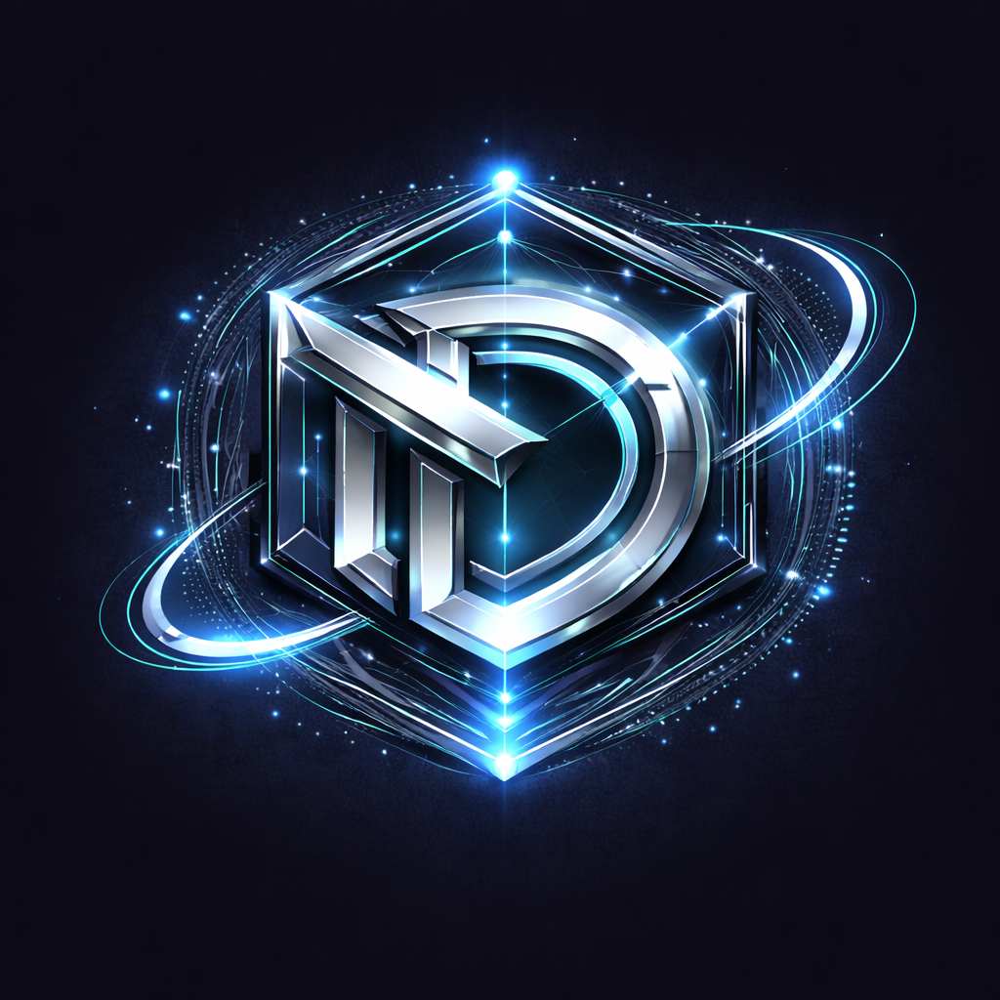
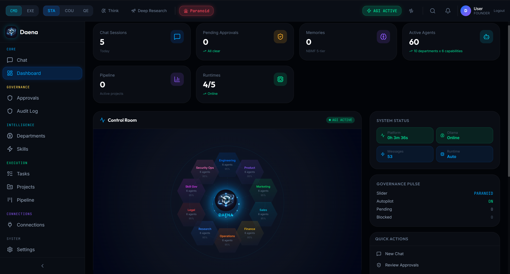
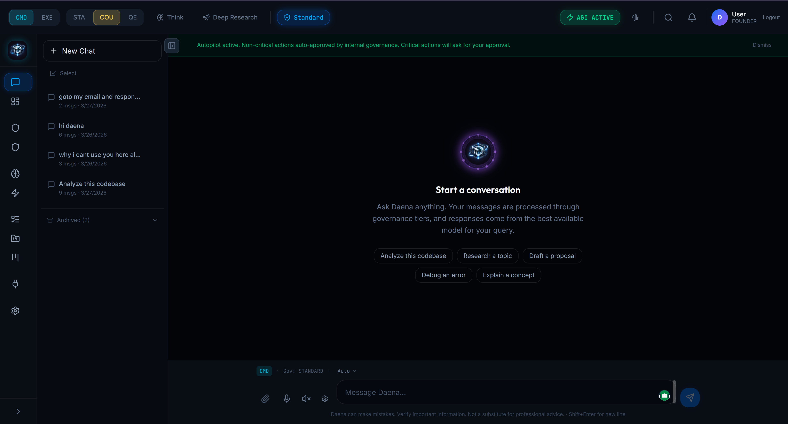
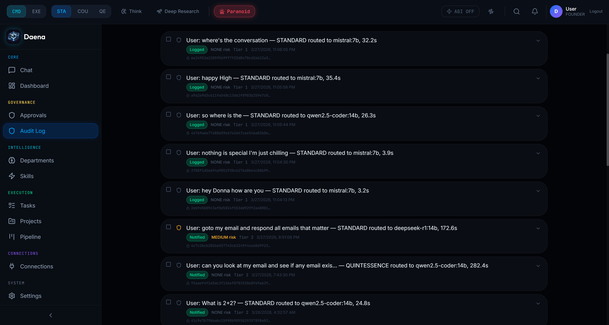
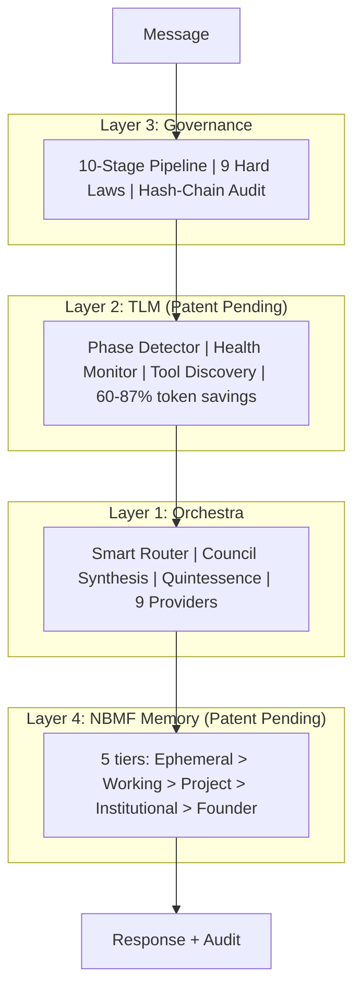

<p align="center">
  <br/>
  <a href="https://mas-ai.co">
    
  </a>
</p>

<h1 align="center">
  
</h1>

<h3 align="center">The First AI Vice President</h3>

<p align="center">
  
</p>

<br/>

<p align="center">
  <a href="#-get-started"></a>
  &nbsp;
  <a href="#-the-problem-every-ai-tool-ignores"></a>
  &nbsp;
  <a href="#-free-vs-pro"></a>
  &nbsp;
  <a href="https://www.youtube.com/watch?v=oST1aJYdEBs"></a>
  &nbsp;
  <a href="mailto:daena@mas-ai.co"></a>
</p>

<p align="center">
  
  
  
  
  
  
  
</p>

<br/>

<p align="center">
  <a href="https://www.youtube.com/watch?v=oST1aJYdEBs">
    
  </a>
</p>

<br/>

<p align="center">
  
</p>

<p align="center">
  
  &nbsp;&nbsp;
  
</p>

<br/>

---

<br/>

## The Problem Every AI Tool Ignores

Every company using AI without governance is **one prompt injection away from disaster**.

Claude Code, Codex, Gemini CLI, OpenClaw -- they're powerful. But they share the same blind spot:

- **No approval gates.** A junior dev's prompt can delete production data.
- **No cost control.** "Hello" costs the same as a 50-page analysis.
- **No audit trail.** When something goes wrong, there's no record of what happened or why.
- **No memory.** Every session starts from zero. Your AI learns nothing.

OpenClaw shipped with [CVE-2026-25253](https://www.oasis.security/blog/openclaw-vulnerability) -- 17,500 servers exposed to the internet with zero authentication. NVIDIA's NemoClaw is a security *wrapper*, not a solution.

**Daena doesn't wrap your tools. It governs them.**

<br/>

---

<br/>

## What Daena Actually Is

**One platform. Every AI model. Every tool. Governed.**

Install Claude Code, Codex, Gemini CLI, or OpenClaw on Daena. Add Ollama for free local AI. Every message passes through a 10-stage governed pipeline. Every decision is auditable. Every action is reversible.

**Your data stays on your machine. Always.**

<p align="center">
  
  &nbsp;
  
  &nbsp;
  
  &nbsp;
  
</p>

<p align="center">
  
  
  
  
  
</p>

Every MCP server, plugin, and skill that works with Claude Code or Codex **already works with Daena**. Nothing to migrate.

<br/>

---

<br/>

## What Makes Daena Different

These aren't features. They're patents. Three technologies that don't exist anywhere else.

<br/>

### NBMF -- Neural-Backed Memory Fabric 

Every other AI tool has amnesia. Daena remembers.

NBMF is a 5-tier trust-gated memory system. Raw observations enter Tier 0 (ephemeral, 1 hour). Only verified, useful knowledge survives promotion to higher tiers. Hallucinations auto-expire. Institutional knowledge becomes permanent.

| Tier | Name | Lifespan | What lives here |
|:----:|:-----|:---------|:----------------|
| T0 | Ephemeral | 1 hour | Raw session context, scratch notes |
| T1 | Working | 7 days | Verified facts from recent work |
| T2 | Project | 1 year | Proven patterns, project decisions |
| T3 | Institutional | Permanent | Company knowledge, team standards |
| T4 | Founder | Permanent | Strategic decisions, founder-only |

**The result:** Daena gets smarter every day you use it. Your AI finally learns from experience instead of starting from zero every session.

Every memory has a SHA-256 hash, a confidence score, and a full audit trail. Hallucinated content doesn't survive Tier 0.

<br/>

### TLM -- Tool Learning & Management 

Every AI tool today dumps its entire tool catalog into every request. 40+ tool schemas. Every turn. Whether you're saying "hello" or building a database.

**That's like bringing every tool in Home Depot to hang a picture frame.**

TLM's Phase Detector analyzes each message in under 0.1ms with zero LLM cost. It loads only the tools relevant to the current turn.

| Scenario | Without TLM | With TLM | Savings |
|:---------|:---:|:---:|:---:|
| 100-turn coding session | 420,000 tokens | 52,000 tokens | **88%** |
| Simple chat (no tools) | 12,000 tokens/turn | 800 tokens/turn | **93%** |
| Mixed workflow | 180,000 tokens | 45,000 tokens | **75%** |

TLM also monitors tool health, discovers new tools at runtime, and retires stale ones. Your agent's toolbelt is always optimized.

<br/>

### PhiLattice Architecture 

Daena's 10 departments aren't arranged randomly. They follow a Fibonacci-derived hexagonal topology (the sunflower-honeycomb pattern) that minimizes communication hops between related departments.

Engineering sits next to Product. Legal sits next to Security. Finance sits next to Operations. The topology is mathematically optimal for information flow between agent teams.

**10 departments. 60 agents. Each with 6 sub-capabilities (MIND, EYES, HANDS, VOICE, SHIELD, MEMORY). Arranged for maximum collaboration, minimum overhead.**

<br/>

---

<br/>

## The 10-Stage Governed Pipeline

Every single message -- whether "hello" or "deploy to production" -- passes through this pipeline. No exceptions.

```
  1.  SecurityGate       Prompt injection scanning
  2.  LoadSession        Fetch context + last 20 messages
  3.  QueryUnderstand    Intent, complexity, risk classification
  3.5 IntentAmplifier    Decode vague requests + select hidden capabilities
  4.  GovernanceCheck    Policy evaluation (tier 0-4)
  5.  CostPreflight      Budget validation
  6.  ModelRouter        Smart model selection + Primary Mind
  7.  MemoryRecall       NBMF context enrichment
  8.  BuildRequest       Format messages + system prompt + runtime params
  9.  LLMStream          Stream response via SSE
 10.  Persist + Audit    Save response, log cost, governance trail
```

**Pipeline overhead: under 25ms.** Invisible for routine tasks. Visible only when it catches something dangerous.

**Stage 3.5 (IntentAmplifier)** is unique to Daena: it detects when a user's request is vague ("fix it", "make it better") and automatically expands it to what a power user would have asked for. It then selects the optimal hidden API capabilities per runtime -- extended thinking for complex reasoning, prompt caching for repeated context, batch APIs for background work -- with zero LLM calls in under 1ms.

The governance engine has 4 tiers:
- **Tier 0-1**: Logged silently. You never notice.
- **Tier 2**: You're notified after the fact.
- **Tier 3+**: Blocks execution. Requires your explicit approval.

Routine queries flow through instantly. Dangerous actions stop and ask. That's the entire philosophy: **govern the 2% that matters, stay invisible for the 98% that doesn't.**

<br/>

---

<br/>

<!-- ============================================================ -->
<!-- EXPANDABLE SECTIONS                                          -->
<!-- Each uses a teal badge as a visual "click me" affordance     -->
<!-- ============================================================ -->

<details>
<summary>&nbsp;&nbsp; How Daena locks down what others leave open</summary>

<br/>

<p align="center">
  
  &nbsp;
  
  &nbsp;
  
</p>

| | Daena | OpenClaw | Others |
|:--|:---:|:---:|:---:|
| Auth on every endpoint | **JWT required** | [CVE-2026-25253](https://www.oasis.security/blog/openclaw-vulnerability) (17.5K exposed) | N/A |
| Network binding | **Loopback only** | 0.0.0.0 (exposed) | Cloud |
| Approval gates | **Tier 0-4** | None | None |
| Immutable laws | **9 hardcoded** | None | None |
| Audit trail | **Hash-chain** | None | None |
| Ports | **Configurable via env** | Hardcoded | N/A |

#### The 9 Hard Laws

These are hardcoded. No user, admin, or founder can modify them.

1. No live trading without human activation
2. No unsupervised financial actions
3. No unbounded execution (every operation has a timeout)
4. Founder bypass is logged, not hidden
5. No data exfiltration without consent + governance
6. No permanent deletion (archive pattern only)
7. Tenant isolation (cross-tenant access impossible)
8. Governance cannot be fully disabled
9. Audit trail is append-only with hash chain

</details>

<br/>

<details>
<summary>&nbsp;&nbsp; How smart routing saves 87% on LLM costs</summary>

<br/>

<p align="center">
  
  &nbsp;
  
  &nbsp;
  
</p>

**The insight:** "Hello" doesn't need GPT-4o. A sort function doesn't need Claude Opus. But every other AI tool charges you the same regardless.

Daena's ModelRouter scores every request across 4 dimensions (tag match, locality, cost, context window) and routes to the cheapest model that can handle it.

| Query | Regular (GPT-4o) | Daena | Savings |
|:------|:---:|:---:|:---:|
| "Hello" | $0.011 | $0.000 (Ollama) | 100% |
| Sort function | $0.016 | $0.000 (local coder) | 100% |
| Debug React | $0.025 | $0.008 (Groq) | 68% |
| Architecture | $0.025 | $0.015 (Sonnet) | 40% |
| **Blended** | **$0.018** | **$0.005** | **60-87%** |

**Enterprise projection (100 users, 50 msgs/day): $14,052/year saved** vs direct GPT-4o.

Set your **Primary Mind** to choose which runtime leads (Claude, Codex, Gemini, or Ollama). Others become intelligent fallbacks. Switch mid-conversation.

</details>

<br/>

<details>
<summary>&nbsp;&nbsp; Multi-model synthesis: 3 AI models debate, then agree</summary>

<br/>

Most AI tools use one model. Daena can use three simultaneously.

**Council Mode:** 3 models from different providers analyze your request independently and in parallel. A meta-synthesis model combines their perspectives. You get the intersection of Claude's reasoning, GPT's breadth, and Gemini's research -- not just one model's opinion.

**Quintessence Mode:** Council + 55 expert lenses. Each model receives a different Domain Competency Profile (DCP) from 3 domains: Engineering, Product, and Design. The synthesis includes expert attribution so you know which perspective influenced the answer.

Both modes require a minimum of 2 selectable models. If only 1 is available, Daena gracefully falls back to Standard mode and tells you why.

</details>

<br/>

<details>
<summary>&nbsp;&nbsp; An AI company that actually works like a company</summary>

<br/>

| Department | What it does | Sub-capabilities |
|:-----------|:------------|:-----------------|
| Engineering | Code review, test generation, debugging | MIND, EYES, HANDS, VOICE, SHIELD, MEMORY |
| Product | Feature tracking, backlog prioritization | MIND, EYES, HANDS, VOICE, SHIELD, MEMORY |
| Marketing | Content drafts, SEO analysis, campaigns | MIND, EYES, HANDS, VOICE, SHIELD, MEMORY |
| Sales | Lead research, outreach, pipeline management | MIND, EYES, HANDS, VOICE, SHIELD, MEMORY |
| Finance | Cost tracking, budget alerts, invoicing | MIND, EYES, HANDS, VOICE, SHIELD, MEMORY |
| Operations | Status reports, scheduling, workflows | MIND, EYES, HANDS, VOICE, SHIELD, MEMORY |
| Research | Competitive analysis, tech scouting | MIND, EYES, HANDS, VOICE, SHIELD, MEMORY |
| Legal & Compliance | Contract review, IP tracking | MIND, EYES, HANDS, VOICE, SHIELD, MEMORY |
| Skill Governance | Skill extraction, quality scoring | MIND, EYES, HANDS, VOICE, SHIELD, MEMORY |
| Security Operations | Threat detection, prompt injection scanning | MIND, EYES, HANDS, VOICE, SHIELD, MEMORY |

Each department has 6 agents. Each agent has specialized sub-capabilities. They share knowledge through NBMF memory tiers and collaborate through the PhiLattice topology.

**DaenaBot tools (always active in EXE mode):**
- **FileAgent** -- File system operations (read/write/search)
- **TerminalAgent** -- Shell command execution (sandboxed)
- **BrowserAgent** -- Web automation (Playwright)
- **MCPAgent** -- MCP tool execution with governance tier classification

</details>

<br/>

<details>
<summary>&nbsp;&nbsp; Gmail, Slack, Notion, GitHub, Figma, and 35+ more</summary>

<br/>

One-click setup. Per-tool Allow/Ask/Block permissions.

Gmail, Slack, Notion, GitHub, Figma, Jira, HubSpot, Salesforce, Stripe, Linear, Discord, Google Drive, Dropbox, AWS, Vercel, Supabase, PlanetScale, Twilio, SendGrid, Airtable, Zapier, and more.

Every connector goes through the same governance pipeline. No tool can act without the appropriate permission level.

**Mobile access:** Install [Chrome Remote Desktop](https://remotedesktop.google.com) on your computer. Open from your phone. Full Daena access -- chat, upload, download, approve governance gates. No mobile app needed.

</details>

<br/>

<details>
<summary>&nbsp;&nbsp; Self-improving agents that get better every day</summary>

<br/>

The Skill Refinery is Department 9. It extracts skills from conversations, refines them through a 3-pass pipeline (gap finder, improver, critic), and stores them for future use.

Skills map to NBMF memory tiers:
- **T0**: Raw extraction (unverified)
- **T1**: Draft (reviewed once)
- **T2**: Refined (multi-pass improvement)
- **T3**: Production (proven reliable)
- **T4**: Compound (combined from multiple sources)

Circuit breaker built in: async semaphore (3 concurrent max), 60s timeout per operation, emergency stop (founder-only), daily token cost cap (100K).

</details>

<br/>

<details>
<summary>&nbsp;&nbsp; How the 4 layers connect</summary>

<br/>



**Three independent control layers:**

| Layer | What it controls | Options |
|:------|:----------------|:--------|
| Reasoning Mode | How Daena thinks | Standard / Council / Quintessence |
| Action Mode | What Daena does | CMD (chat only) / EXE (real actions) |
| Continuation Mode | Does Daena keep working? | Autopilot OFF / Autopilot ON |

</details>

<br/>

---

<br/>

## Free vs Pro

<table>
<tr>
<td align="center" width="50%">

### Free Forever

**Full platform. $0.**

Install Daena + your own tools.
Use your Claude, OpenAI, or Google subscriptions.
Add Ollama for unlimited free local AI.

**Every feature. Every agent. Every department.
Your tools. Your data. Your machine.**

</td>
<td align="center" width="50%">

### Daena Pro

**All LLMs included. One price.**

Claude 4.6 + GPT-5.4 + Gemini 3 Pro
\+ Codex 3 + Groq + Perplexity
All included. No API keys needed.

**Instead of $200 + $200 + $200 = $600/mo,
pay $29-99/mo for everything.**

</td>
</tr>
</table>

> **Same platform. Same features. Same 60 agents.** Free = bring your own LLMs. Pro = we provide them all.

<details>
<summary>&nbsp;&nbsp; Verified March 2026</summary>

<br/>

| | Perplexity | ChatGPT Pro | Claude Max | Manus | **Daena Free** | **Daena Pro** |
|:--|:---:|:---:|:---:|:---:|:---:|:---:|
| **Price** | $200/mo | $200/mo | $200/mo | $39-200/mo | **$0** | **$29-99/mo** |
| **Claude 4.6** | No | No | Yes | No | Bring yours | **Included** |
| **GPT-5.4** | Limited | Yes | No | No | Bring yours | **Included** |
| **Gemini 3 Pro** | No | No | No | No | Bring yours | **Included** |
| **Free local AI** | No | No | No | No | **Ollama** | **Ollama** |
| **Install Claude Code** | No | No | N/A | No | **Yes** | **Yes** |
| **All MCP + plugins** | No | No | Some | No | **Yes** | **Yes** |
| **10-stage governance** | No | No | No | No | **Yes** | **Yes** |
| **60 agents** | No | No | No | No | **Yes** | **Yes** |
| **Works offline** | No | No | No | No | **Yes** | **Yes** |
| **Source available** | No | No | No | No | **BSL 1.1** | **BSL 1.1** |

</details>

<br/>

---

<br/>

## Get Started

### 1. Install Daena

```bash
git clone https://github.com/Mas-AI-Official/daena.git
cd daena

# Backend
cd backend && python -m venv .venv
.venv\Scripts\activate && pip install -e ".[dev]" && python run.py

# Frontend (new terminal)
cd frontend && npm install && npm run dev
```

Or use Docker: `docker compose up -d`
Or double-click: `setup-daena.bat` (Windows)

### 2. Install Ollama (free local AI)

Download from [ollama.ai](https://ollama.ai), then:

```bash
ollama pull llama3.1:8b          # 4.7 GB -- general chat
ollama pull qwen2.5-coder:14b   # 9 GB -- coding
ollama pull deepseek-r1:14b     # 9 GB -- reasoning
```

> 8 GB disk for basics. 22 GB for all three. GPU recommended but CPU works.

### 3. Install your tools (optional)

```bash
npm install -g @anthropic-ai/claude-code    # Uses your Anthropic subscription
npm install -g @openai/codex                # Uses your OpenAI subscription
npm install -g @google/gemini-cli           # Uses your Google subscription
```

### 4. Open and go

`http://127.0.0.1:5173` -- Create Account -- Start chatting.
**API keys are optional.** Daena works with Ollama alone.

<details>
<summary>&nbsp;&nbsp; Add cloud providers for more power</summary>

<br/>

| Provider | Key format | Where to get it |
|:---------|:-----------|:----------------|
| Anthropic | `sk-ant-...` | [console.anthropic.com](https://console.anthropic.com) |
| OpenAI | `sk-...` | [platform.openai.com](https://platform.openai.com) |
| Google | `AIza...` | [aistudio.google.com](https://aistudio.google.com) |
| Groq | `gsk_...` | [console.groq.com](https://console.groq.com) |

Add in Settings or `backend/.env`. Zero required.

</details>

<br/>

---

<br/>

## Tech Stack + API + Roadmap

<table>
<tr>
<td width="50%" valign="top">

**Backend**: Python 3.12, FastAPI, SQLAlchemy 2.0, Pydantic v2, JWT + OAuth2, AES-256

**Frontend**: React 18, TypeScript, Vite (103KB gzip), Tailwind, Zustand, Framer Motion

</td>
<td width="50%" valign="top">

**Infra**: Docker, GCP Cloud Run, PostgreSQL 16, Redis 7

**LLMs**: Ollama, Anthropic, OpenAI, Gemini, Groq, OpenRouter, Together, Perplexity

</td>
</tr>
</table>

<details>
<summary>&nbsp;&nbsp; Full endpoint list</summary>

<br/>

| Group | Endpoints |
|:------|:---------|
| Auth | `/auth/register`, `/auth/login`, `/auth/refresh` |
| Chat | `/chat/stream` (SSE), `/chat/sessions`, `/chat/model-registry` |
| Governance | `/governance/audit`, `/governance/approvals/{id}/decide` |
| Agents | `/agents/departments`, `/agents/capabilities` |
| Memory | `/memory/stats`, `/memory/memories` |
| Execution | `/execution/tasks`, `/execution/retry` |
| Settings | `/settings/user` (JSONB preferences) |
| Runtimes | `/runtimes`, `/runtimes/primary`, `/runtimes/{id}/test` |
| Billing | `/billing/overview`, `/billing/by-provider` |
| Connections | `/connections/connectors`, `/connections/instances` |
| Skills | `/skills/installed`, `/skills/catalog` |
| Heartbeat | `/heartbeat/status`, `/heartbeat/start`, `/heartbeat/stop` |

</details>

<br/>

<details>
<summary>&nbsp;&nbsp; What's shipped and what's next</summary>

<br/>

**Shipped**: 10-stage pipeline, 9 providers, Council + Quintessence, TLM, Health Monitor, 60 agents, NBMF memory, Hash-chain audit trail, Voice (TTS + STT), DaenaBot, Autopilot, Mobile API, 40+ connectors, Docker + GCP

**Next**: Custom Department Builder, Onboarding Wizard, Dream Engine (patent pending), Desktop App, Enterprise SSO, Mobile App

</details>

<br/>

<details>
<summary>&nbsp;&nbsp; How to contribute</summary>

<br/>

See [CONTRIBUTING.md](CONTRIBUTING.md). Run `cd backend && python -m pytest tests/ -v` (1424 tests). Run `cd frontend && npx tsc --noEmit` (0 errors).

</details>

<br/>

<details>
<summary>&nbsp;&nbsp; BSL 1.1 with Apache 2.0 conversion</summary>

<br/>

**BSL 1.1** -- Free for internal, personal, educational use. Converts to **Apache 2.0** on March 27, 2030.

Patents pending: NBMF (Neural-Backed Memory Fabric), PhiLattice Architecture, TLM (Tool Learning & Management).

</details>

<br/>

---

<br/>

## The Team

<table>
<tr>
<td width="100" align="center">
  <a href="mailto:daena@mas-ai.co"><br/><strong>Daena</strong></a><br/>
  <sub>AI Vice President</sub><br/>
  <a href="mailto:daena@mas-ai.co"></a>
</td>
<td width="100" align="center">
  <a href="mailto:masoud.masoori@mas-ai.co"><br/><strong>Masoud Masoori</strong></a><br/>
  <sub>Founder & CEO</sub><br/>
  <a href="mailto:masoud.masoori@mas-ai.co"></a>
</td>
<td>
  <strong><a href="https://mas-ai.co">MAS-AI Technologies Inc.</a></strong><br/>
  Richmond Hill, Ontario, Canada
</td>
</tr>
</table>

<br/>

---

<br/>

<p align="center">
  
</p>

<p align="center">
  
</p>

<p align="center">
  <sub><strong>D A E N A</strong> v3.6.0 &nbsp;|&nbsp; Patent pending: NBMF, PhiLattice, TLM &nbsp;|&nbsp; &copy; 2026 MAS-AI Technologies Inc.</sub>
</p>
