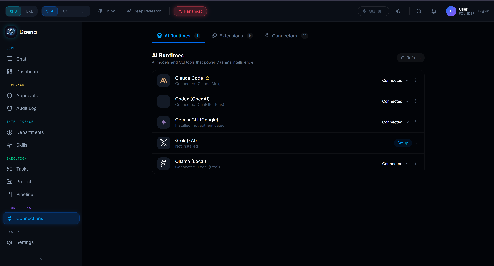
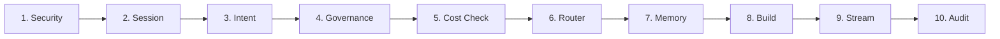
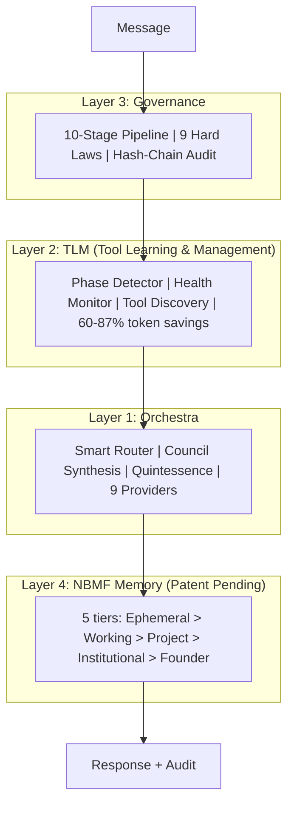

<p align="center">
  <br/>
  <br/>
  
  <br/>
  <br/>
</p>

<h1 align="center">
  
</h1>

<p align="center">
  
</p>

<p align="center">
  
</p>

<br/>

<p align="center">
  <a href="#get-started"></a>
  &nbsp;&nbsp;
  <a href="#how-it-works"></a>
  &nbsp;&nbsp;
  <a href="#free-vs-pro"></a>
  &nbsp;&nbsp;
  <a href="mailto:daena@mas-ai.co"></a>
</p>

<br/>

<p align="center">
  
  
  
  
  
  
  
</p>

<br/>

<p align="center">
  <a href="https://www.youtube.com/watch?v=oST1aJYdEBs">
    
  </a>
</p>

<p align="center">
  <a href="https://www.youtube.com/watch?v=oST1aJYdEBs">
    
  </a>
</p>

<br/>

<p align="center">
  
</p>

<p align="center">
  
  &nbsp;
  
</p>

<br/>

<p align="center">
  <strong>One platform. Every AI model. Every tool. Governed.</strong>
</p>

<p align="center">
  <sub>Install Claude Code, Codex, Gemini CLI, or OpenClaw on Daena. Add Ollama for free local AI.<br/>
  Daena orchestrates everything, governs every decision, and saves you 60-87%.<br/>
  Your data stays on your machine. Always.</sub>
</p>

<br/>

---

<br/>

<h2 align="center">
  
</h2>

<br/>

<p align="center">
  
  &nbsp;
  
  &nbsp;
  
  &nbsp;
  
</p>

<p align="center">
  
  
  
  
  
  
  
</p>

<p align="center">
  <sub>Every MCP server, plugin, and skill that works with Claude Code or Codex <strong>already works with Daena</strong>.<br/>
  Access Daena from your phone via <a href="https://remotedesktop.google.com">Chrome Remote Desktop</a> -- full access, no app needed.</sub>
</p>

<br/>

---

<br/>

<h2 id="free-vs-pro" align="center">
  
</h2>

<br/>

<table>
<tr>
<td align="center" width="50%">
<br/>


<br/><br/>

**Full platform. $0.**

Install Daena + your own tools.
Use your Claude, OpenAI, or Google subscriptions.
Add Ollama for unlimited free local AI.

Every feature. Every agent. Every department.
Your tools. Your data. Your machine.

<br/>
</td>
<td align="center" width="50%">
<br/>


<br/><br/>

**All LLMs included. One price.**

Claude 4.6 + GPT-5.4 + Gemini 3 Pro
\+ Codex 3 + Groq + Perplexity
All included. No API keys to manage.

Instead of $200 + $200 + $200 = $600/mo,
pay **$29-99/mo** for everything.

<br/>
</td>
</tr>
</table>

<br/>

> **Same platform. Same features. Same 60 agents.** Free = bring your own LLMs. Pro = we provide them all.

<br/>

<details>
<summary><strong>See pricing vs competitors (verified March 2026)</strong></summary>
<br/>

| | Perplexity | ChatGPT Pro | Claude Max | Manus | **Daena Free** | **Daena Pro** |
|:--|:---:|:---:|:---:|:---:|:---:|:---:|
| **Price** | $200/mo | $200/mo | $200/mo | $39-200/mo | **$0** | **$29-99/mo** |
| **Claude 4.6** | No | No | Yes | No | Bring yours | **Included** |
| **GPT-5.4 / Codex 3** | Limited | Yes | No | No | Bring yours | **Included** |
| **Gemini 3 Pro** | No | No | No | No | Bring yours | **Included** |
| **Local Ollama (free)** | No | No | No | No | **Yes** | **Yes** |
| **Install Claude Code** | No | No | N/A | No | **Yes** | **Yes** |
| **Install Codex CLI** | No | N/A | No | No | **Yes** | **Yes** |
| **All MCP + plugins** | No | No | Some | No | **Yes** | **Yes** |
| **10-stage governance** | No | No | No | No | **Yes** | **Yes** |
| **60 agents** | No | No | No | No | **Yes** | **Yes** |
| **Works offline** | No | No | No | No | **Yes** | **Yes** |
| **Security** | Unknown | Unknown | Clean | Unknown | **[9 hard laws](#security)** | **9 hard laws** |

</details>

<br/>

---

<br/>

<h2 id="how-it-works" align="center">
  
</h2>

<br/>

<p align="center">
  
  &nbsp;&nbsp;
  
</p>

<p align="center">
  <sub>Left: Governed chat with mode toggles. Right: Every decision logged with full audit trail.</sub>
</p>

<br/>

Every message passes through a **10-stage governed pipeline**:



| Stage | What | Overhead |
|:------|:-----|:--------:|
| Security | 9 prompt injection patterns scanned | <1ms |
| Governance | Policy evaluation, tier 0-4 | <1ms |
| Router | Pick cheapest capable model | <1ms |
| Memory | Enrich from NBMF 5-tier memory | ~10ms |
| **Total overhead** | | **<25ms** |

<br/>

<details>
<summary><strong>4-Layer Architecture</strong></summary>
<br/>


</details>

<details>
<summary><strong>Key Features</strong></summary>
<br/>

**Multi-Runtime**: 9 providers -- Ollama, Claude, GPT, Gemini, Groq, OpenRouter, Together, Perplexity. Set your Primary Mind to choose which runtime leads.

**TLM**: Phase Detector analyzes each message (zero LLM cost, <0.1ms) and loads only the tools needed. 100-turn session: 420K tokens baseline vs 52K with TLM = **87% saved**.

**Council + Quintessence**: 3 models analyze independently. Quintessence adds 55 expert lenses across 5 domains.

**10 Departments, 60 Agents, 133 Skills**: Engineering, Product, Marketing, Sales, Finance, Operations, Research, Legal, Skill Governance, Security.

**NBMF Memory**: 5 trust-gated tiers. Hallucinations auto-expire. SHA-256 dedup.

**DaenaBot**: FileAgent, TerminalAgent, BrowserAgent, MCPAgent. All pass through governance.

**Mobile + Remote**: Built-in API + Chrome Remote Desktop for full phone access.

**Skill Refinery**: Self-improving agents. 3-pass pipeline: gap finder, improver, critic.

</details>

<br/>

---

<br/>

<h2 id="security" align="center">
  
</h2>

<br/>

<p align="center">
  
  &nbsp;
  
  &nbsp;
  
  &nbsp;
  
</p>

<br/>

| Protection | Daena | OpenClaw | ChatGPT | Claude |
|:-----------|:-----:|:--------:|:-------:|:------:|
| Prompt injection scan | **9 patterns, <1ms** | None | Unknown | Unknown |
| JWT on every endpoint | **Yes** | [CVE-2026-25253](https://www.oasis.security/blog/openclaw-vulnerability) | N/A | N/A |
| Loopback-only binding | **127.0.0.1 default** | 0.0.0.0 (exposed) | Cloud | Cloud |
| Approval gates | **Tier 0-4** | None | None | None |
| Hash-chain audit | **Every decision** | None | None | None |
| Immutable hard laws | **9 laws, cannot disable** | None | None | None |
| Configurable ports | **Via env vars** | Hardcoded | N/A | N/A |

<details>
<summary><strong>The 9 Immutable Hard Laws</strong></summary>
<br/>

1. **No live trading without human activation** -- broker adapters stay dry-run until explicitly enabled
2. **No unsupervised financial actions** -- transfers, payments require Tier 3+ approval
3. **No unbounded execution** -- every operation has a timeout; runaway processes are killed
4. **Founder bypass is logged, not hidden** -- founder can override governance but every override is recorded
5. **No data exfiltration** -- no agent transmits user data to external services without consent + governance
6. **No permanent deletion** -- all "deletes" use archive pattern; data is soft-deleted with timestamp
7. **Tenant isolation** -- data from one tenant is NEVER accessible to another
8. **Governance cannot be disabled** -- even YOLO mode enforces hard laws and logs critical actions
9. **Audit trail integrity** -- append-only hash chain; any gap triggers integrity alert

These laws are hardcoded. They cannot be modified by any user, admin, or founder through the UI or API.

</details>

<br/>

---

<br/>

<h2 align="center">
  
</h2>

<br/>

<p align="center">
  
  &nbsp;&nbsp;
  
  &nbsp;&nbsp;
  
</p>

<br/>

| How | What | Savings |
|:----|:-----|:-------:|
| **Smart Routing** | "Hello" goes to free Ollama. Complex reasoning goes to Claude. | 50-100% |
| **TLM Phase Detection** | Loads only active tool schemas, not all 20+ | 60-87% |
| **Governance** | Blocks bad actions before tokens are spent | Prevents waste |
| **NBMF Memory** | Remembers context so you don't re-explain | Fewer turns |

<details>
<summary><strong>Detailed benchmark (10 scenarios)</strong></summary>
<br/>

| Query | Regular (GPT-4o) | Daena | Savings |
|:------|:---:|:---:|:---:|
| "Hello" | $0.011 | $0.000 (Ollama) | 100% |
| "Write a sort function" | $0.016 | $0.000 (local coder) | 100% |
| "Debug React crash" | $0.025 | $0.008 (Groq) | 68% |
| "Architecture design" | $0.025 | $0.015 (Sonnet) | 40% |
| **Blended average** | **$0.018** | **$0.005** | **60-87%** |

Enterprise (100 users, 50 msgs/day): **$14,052/year saved**.

</details>

<br/>

---

<br/>

<h2 id="get-started" align="center">
  
</h2>

<br/>

### 1. Install Daena

```bash
git clone https://github.com/Mas-AI-Official/daena.git
cd daena

# Backend
cd backend && python -m venv .venv
.venv\Scripts\activate              # Windows (source .venv/bin/activate for Mac/Linux)
pip install -e ".[dev]" && python run.py

# Frontend (new terminal)
cd frontend && npm install && npm run dev
```

Or: `docker compose up -d`

### 2. Install Ollama (free local AI)

```bash
# Download from ollama.ai, then:
ollama pull llama3.1:8b          # 4.7 GB - general chat
ollama pull qwen2.5-coder:14b   # 9 GB - coding
ollama pull deepseek-r1:14b     # 9 GB - reasoning
```

> 8 GB disk for basics. 22 GB for coding + reasoning. GPU recommended but CPU works.

### 3. Install your tools on Daena

```bash
npm install -g @anthropic-ai/claude-code    # Your Anthropic subscription
npm install -g @openai/codex                # Your OpenAI subscription
npm install -g @google/gemini-cli           # Your Google subscription
```

### 4. Open and register

Go to `http://127.0.0.1:5173` -- Create Account -- Send your first message.

**That's it. You have a governed AI operating system.**

<details>
<summary><strong>Access from your phone</strong></summary>
<br/>

Install [Chrome Remote Desktop](https://remotedesktop.google.com) on your computer. Open it from your phone's browser. Full Daena access -- upload, download, chat, everything. No mobile app needed. Or use Daena's built-in Mobile API for quick commands.

</details>

<details>
<summary><strong>Add API keys (optional)</strong></summary>
<br/>

| Provider | Key | Where |
|:---------|:----|:------|
| Anthropic | `sk-ant-...` | [console.anthropic.com](https://console.anthropic.com) |
| OpenAI | `sk-...` | [platform.openai.com](https://platform.openai.com) |
| Google | `AIza...` | [aistudio.google.com](https://aistudio.google.com) |
| Groq | `gsk_...` | [console.groq.com](https://console.groq.com) |
| OpenRouter | `sk-or-...` | [openrouter.ai](https://openrouter.ai) |

Add in Settings or `backend/.env`. No keys required to start.

</details>

<br/>

---

<br/>

<h2 align="center">
  
</h2>

<br/>

<table>
<tr>
<td width="50%" valign="top">

**Backend**: Python 3.12, FastAPI, SQLAlchemy 2.0, Pydantic v2, JWT + OAuth2, AES-256 vault

**Frontend**: React 18, TypeScript, Vite (103KB bundle), Tailwind, Zustand, Framer Motion

</td>
<td width="50%" valign="top">

**Infrastructure**: Docker, GCP Cloud Run, PostgreSQL 16, Redis 7

**LLM Providers**: Ollama, Anthropic, OpenAI, Gemini, Groq, OpenRouter, Together, Perplexity

</td>
</tr>
</table>

<details>
<summary><strong>API Reference (30+ endpoints)</strong></summary>
<br/>

| Group | Endpoints |
|:------|:---------|
| **Auth** | `/auth/register`, `/auth/login`, `/auth/refresh` |
| **Chat** | `/chat/stream` (SSE), `/chat/sessions` |
| **Governance** | `/governance/audit`, `/governance/approvals/{id}/decide` |
| **Agents** | `/agents/departments`, `/skills/catalog` |
| **Mobile** | `/mobile/command`, `/mobile/quick-action`, `/mobile/approve/{id}` |
| **Benchmark** | `/benchmark/cost-comparison`, `/benchmark/quick-summary` |

</details>

<details>
<summary><strong>Roadmap</strong></summary>
<br/>

**Shipped (v3.6.0)**: 10-stage pipeline, 9 providers, Council + Quintessence, TLM, Health Monitor, Smart Routing, 60 agents, NBMF memory, Audit trail, Voice, DaenaBot, Autopilot, Mobile API, Session sync, Cost Benchmark, Docker + GCP deploy

**Next**: Custom Department Builder, Onboarding Wizard, Dream Engine (patent pending), Desktop App, Enterprise SSO

</details>

<details>
<summary><strong>Contributing</strong></summary>
<br/>

See [CONTRIBUTING.md](CONTRIBUTING.md). Priority: runtime adapters, governance patterns, skills, TLM improvements.

```bash
cd backend && python -m pytest tests/ -v   # 1424 tests
cd frontend && npx tsc --noEmit            # 0 errors
```

</details>

<details>
<summary><strong>License</strong></summary>
<br/>

**BSL 1.1** -- Free for internal, personal, educational, research use. Commercial license for competing hosted services. Converts to **Apache 2.0** on March 27, 2030.

**Patents**: NBMF, PhiLattice Architecture, TLM (USPTO provisional applications filed).

</details>

<br/>

---

<br/>

## The Team

<table>
<tr>
<td width="120" align="center">
  <a href="mailto:daena@mas-ai.co">
    
    <br/><strong>Daena</strong>
  </a>
  <br/><sub>AI Vice President</sub>
  <br/><a href="mailto:daena@mas-ai.co"></a>
</td>
<td width="120" align="center">
  <a href="mailto:masoud.masoori@mas-ai.co">
    
    <br/><strong>Masoud Masoori</strong>
  </a>
  <br/><sub>Founder & CEO</sub>
  <br/><a href="mailto:masoud.masoori@mas-ai.co"></a>
</td>
<td>
  <strong>MAS-AI Technologies Inc.</strong><br/>
  Richmond Hill, Ontario, Canada<br/><br/>
  <a href="https://mas-ai.co"></a>
</td>
</tr>
</table>

<br/>

---

<br/>

<p align="center">
  
</p>

<p align="center">
  
</p>

<p align="center">
  <sub><strong>D A E N A</strong> v3.6.0 | Patent pending: NBMF, PhiLattice, TLM | &copy; 2026 MAS-AI Technologies Inc.</sub>
</p>

<br/>
