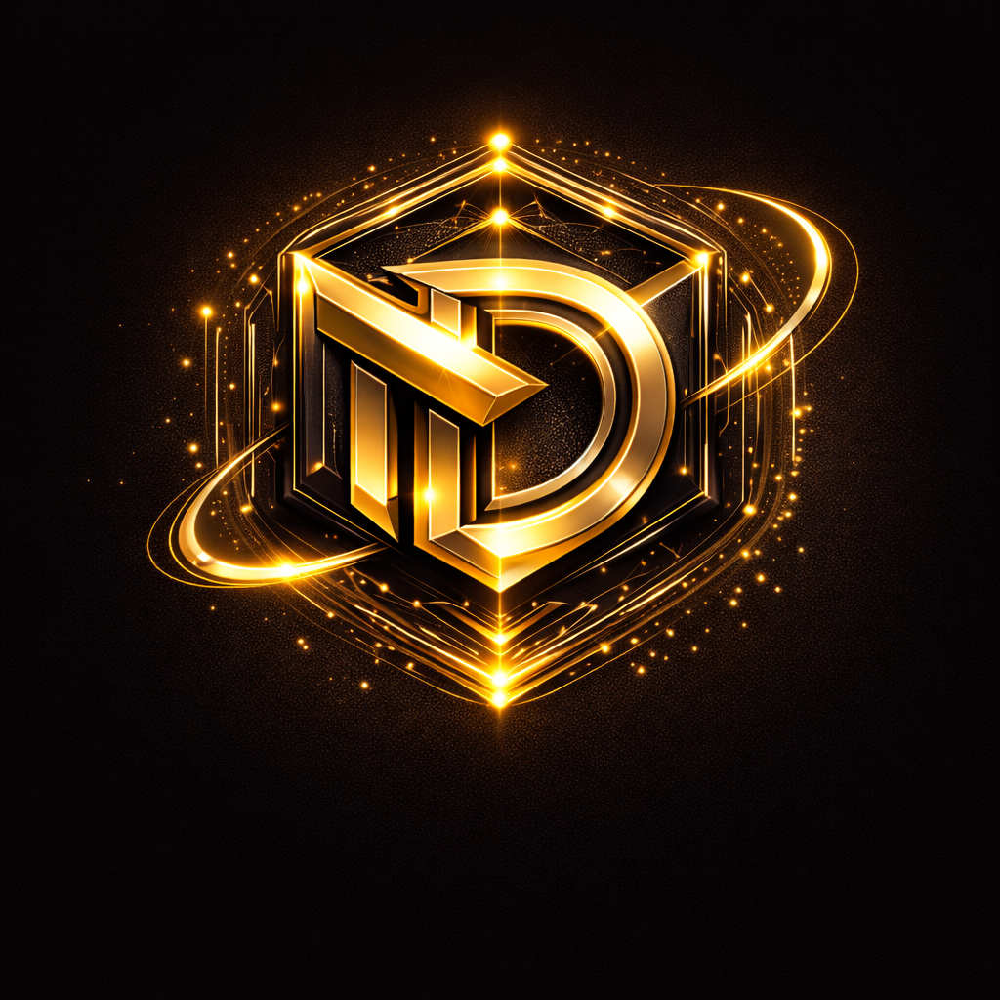
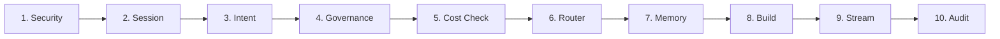
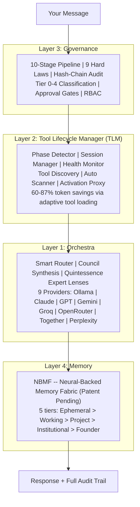

<p align="center">
  <br/>
  <br/>
  
  <br/>
  <br/>
</p>

<h1 align="center">D &nbsp; A &nbsp; E &nbsp; N &nbsp; A</h1>

<p align="center">
  <em>Your AI Vice President</em>
</p>

<p align="center">
  <a href="#get-started"></a>
  &nbsp;&nbsp;
  <a href="#how-it-works"></a>
  &nbsp;&nbsp;
  <a href="#free-vs-pro"></a>
  &nbsp;&nbsp;
  <a href="mailto:daena@mas-ai.co"></a>
</p>

<br/>

<p align="center">
  
  &nbsp;
  
  &nbsp;
  
  &nbsp;
  
  &nbsp;
  
  &nbsp;
  
  &nbsp;
  
</p>

<br/>
<br/>

<p align="center">
  
</p>

<br/>

<p align="center">
  <strong>One platform. Every AI model. Every tool. Governed.</strong><br/><br/>
  <sub>Install Claude Code, Codex, Gemini CLI, or OpenClaw on Daena.<br/>
  Add Ollama for free local models. Bring your existing subscriptions.<br/>
  Daena orchestrates everything, governs every decision, and saves you 60-87%.</sub>
</p>

<br/>

---

<br/>

<h2 align="center">Install your tools. Daena runs them all.</h2>

<br/>

<p align="center">
  
  &nbsp;
  
  &nbsp;
  
  &nbsp;
  
</p>

<p align="center">
  
  &nbsp;
  
  &nbsp;
  
  &nbsp;
  
  &nbsp;
  
  &nbsp;
  
  &nbsp;
  
</p>

<br/>

<p align="center">
  Every MCP server, plugin, and skill that works with Claude Code or Codex<br/>
  <strong>already works with Daena.</strong> Nothing to migrate. Nothing to rewrite.
</p>

<br/>

---

<br/>

<h2 id="free-vs-pro" align="center">Free vs Pro</h2>

<br/>

<table>
<tr>
<td align="center" width="50%">
<br/>


<br/><br/>

**Full platform. $0.**

Install Daena + your own tools.
Use your Claude, OpenAI, or Google subscriptions.
Add Ollama for unlimited free local AI.

Every feature. Every agent. Every department.
Your tools. Your data. Your machine.

<br/>
</td>
<td align="center" width="50%">
<br/>


<br/><br/>

**All LLMs included. One price.**

Claude 4.6 + GPT-5.4 + Gemini 3 Pro
\+ Codex 3 + Groq + Perplexity
All included. No API keys to manage.

Instead of $200 + $200 + $200 = $600/mo,
pay **$29-99/mo** for everything.

<br/>
</td>
</tr>
</table>

<br/>

> **Same platform. Same features. Same 60 agents.** The only difference: Free = bring your own LLMs. Pro = we provide them all.

<br/>

<details>
<summary><strong>See full comparison vs competitors (pricing verified March 2026)</strong></summary>

<br/>

> Sources: [Perplexity](https://www.trysliq.com/blog/perplexity-computer-cost) | [ChatGPT](https://chatgpt.com/pricing) | [Claude](https://claude.com/pricing/max) | [Manus](https://www.getaiperks.com/en/articles/manus-ai-pricing)

| | Perplexity | ChatGPT Pro | Claude Max | Manus | **Daena Free** | **Daena Pro** |
|:--|:---:|:---:|:---:|:---:|:---:|:---:|
| **Price** | $200/mo | $200/mo | $200/mo | $39-200/mo | **$0** | **$29-99/mo** |
| **Claude 4.6** | No | No | Yes | No | Bring yours | **Included** |
| **GPT-5.4 / Codex 3** | Limited | Yes | No | No | Bring yours | **Included** |
| **Gemini 3 Pro** | No | No | No | No | Bring yours | **Included** |
| **Groq + Perplexity** | Perplexity only | No | No | No | Bring yours | **Included** |
| **Local Ollama (free)** | No | No | No | No | **Yes** | **Yes** |
| **Install Claude Code** | No | No | N/A | No | **Yes** | **Yes** |
| **Install Codex CLI** | No | N/A | No | No | **Yes** | **Yes** |
| **All MCP + plugins** | No | No | Some | No | **Yes** | **Yes** |
| **10-stage governance** | No | No | No | No | **Yes** | **Yes** |
| **60 agents** | No | No | No | No | **Yes** | **Yes** |
| **Audit trail** | No | No | No | No | **Yes** | **Yes** |
| **Cost optimization** | No | No | No | No | **60-87% savings** | **Yes** |
| **Works offline** | No | No | No | No | **Yes** | **Yes** |
| **Security** | Unknown | Unknown | Clean | Unknown | **[9 hard laws](#security-not-like-openclaw)** | **9 hard laws** |
| **Source available** | No | No | No | No | **BSL 1.1** | **BSL 1.1** |

</details>

<br/>

---

<br/>

<h2 id="how-it-works" align="center">How It Works</h2>

<br/>

<p align="center">
  
  &nbsp;&nbsp;
  
</p>

<p align="center">
  <sub>Left: Chat with mode toggles (CMD/EXE, Standard/Council/Quintessence, Autopilot).<br/>
  Right: Every decision logged -- model, cost, latency, governance tier.</sub>
</p>

<br/>

Every message passes through a **10-stage governed pipeline**:



| Stage | What | Overhead |
|:------|:-----|:--------:|
| Security | Prompt injection scan (9 patterns) | <1ms |
| Intent | Classify query type + complexity + risk | <1ms |
| Governance | Policy evaluation, tier 0-4 | <1ms |
| Router | Pick cheapest capable model | <1ms |
| Memory | Enrich from NBMF 5-tier memory | ~10ms |
| **Total pipeline overhead** | | **<25ms** |

Governance is invisible. It does not slow you down. It protects you.

<br/>

<details>
<summary><strong>4-Layer Architecture (click to expand)</strong></summary>

<br/>



</details>

<br/>

<details>
<summary><strong>Key features (click to expand)</strong></summary>

<br/>

### Multi-Runtime Orchestration

9 providers. You choose the **Primary Mind** -- the runtime that leads. The rest become fallbacks. If Ollama is offline, Daena cascades to the next available provider automatically. The user sees an explanation, not an error.

### Tool Lifecycle Manager (TLM)

Instead of loading all 20+ tool schemas every turn (4,000+ wasted tokens), TLM's Phase Detector analyzes your message with keyword heuristics (zero LLM cost, <0.1ms) and loads only the tools you need right now.

**100-turn session: 420,000 tokens baseline vs 52,500 with TLM = 87% saved.**

### Council + Quintessence

- **Council**: 3 models analyze independently, Daena synthesizes the best answer
- **Quintessence**: Council + 55 expert lenses across 5 domains

### 10 Departments, 60 Agents, 133 Skills

Engineering, Product, Marketing, Sales, Finance, Operations, Research, Legal, Skill Governance, Security. Each with 6 sub-capabilities. All skills carry governance badges.

### NBMF Memory (Patent Pending)

5 trust-gated tiers. Hallucinations auto-expire. Only verified knowledge persists. SHA-256 dedup. Obsidian-compatible vault export.

### Security (Not Like OpenClaw)

OpenClaw exposed [17,500+ instances](https://www.oasis.security/blog/openclaw-vulnerability) via CVE-2026-25253. Daena:
- Binds to `127.0.0.1` only (loopback). Nothing exposed to network.
- JWT required on every endpoint. No anonymous access.
- 9 immutable hard laws that cannot be disabled.
- Configurable ports via environment variables.
- Hash-chain audit trail. Tier-based approval gates.

### DaenaBot (EXE Mode)

FileAgent, TerminalAgent, BrowserAgent, MCPAgent, ActionPlanner. All executions pass through governance.

### Mobile + Remote

Built-in Mobile API for quick commands and approvals. Access full Daena via Chrome Remote Desktop from any phone.

### Skill Refinery

Self-improving agents. 3-pass pipeline: gap finder, improver, critic. Skills earn trust over time.

</details>

<br/>

---

<br/>

<h2 id="get-started" align="center">Get Started</h2>

<br/>

### 1. Install Daena (2 minutes)

```bash
git clone https://github.com/Mas-AI-Official/daena.git
cd daena

# Backend
cd backend && python -m venv .venv
.venv\Scripts\activate              # Windows
pip install -e ".[dev]" && python run.py

# Frontend (new terminal)
cd frontend && npm install && npm run dev
```

Or with Docker: `docker compose up -d`

### 2. Install Ollama (free local AI)

```bash
# Download from ollama.ai, then:
ollama pull llama3.1:8b          # 4.7 GB -- general chat
ollama pull qwen2.5-coder:14b   # 9 GB -- coding
ollama pull deepseek-r1:14b     # 9 GB -- reasoning
```

> **Disk space**: 8 GB for basics, 22 GB for coding + reasoning, 45 GB for everything.
> **GPU**: 8 GB VRAM runs Tier 1. 16 GB runs all. CPU works too, just slower.

### 3. Install your tools on Daena (optional)

```bash
npm install -g @anthropic-ai/claude-code    # Uses your Anthropic subscription
npm install -g @openai/codex                # Uses your OpenAI subscription
npm install -g @google/gemini-cli           # Uses your Google subscription
```

Every MCP server and plugin that works with these tools **works with Daena automatically**.

### 4. Open and register

1. Go to `http://127.0.0.1:5173`
2. Click **Create Account** (local only, data never sent anywhere)
3. Send your first message
4. Check the **Audit Log** to see the full decision trail

**That's it. You have a governed AI operating system.**

<br/>

<details>
<summary><strong>Add API keys for direct LLM access (optional)</strong></summary>

<br/>

| Provider | Key format | Where to get |
|:---------|:-----------|:-------------|
| Anthropic | `sk-ant-...` | [console.anthropic.com](https://console.anthropic.com) |
| OpenAI | `sk-...` | [platform.openai.com](https://platform.openai.com) |
| Google | `AIza...` | [aistudio.google.com](https://aistudio.google.com) |
| Groq | `gsk_...` | [console.groq.com](https://console.groq.com) |
| OpenRouter | `sk-or-...` | [openrouter.ai](https://openrouter.ai) |

Add in `Settings > LLM Providers` or in `backend/.env`. No keys required to start.

</details>

<br/>

---

<br/>

<h2 align="center">Cost Savings</h2>

<br/>

<p align="center">
  
  &nbsp;&nbsp;
  
  &nbsp;&nbsp;
  
</p>

<br/>

| How Daena Saves | What It Does | Impact |
|:----------------|:-------------|:------:|
| **Smart Routing** | "Hello" goes to free Ollama. Complex reasoning goes to Claude. | **50-100% per query** |
| **TLM Phase Detection** | Loads only active tool schemas, not all 20+ | **60-87% tokens saved** |
| **Governance** | Blocks bad actions before tokens are spent | **Prevents waste** |
| **Memory (NBMF)** | Remembers context so you don't re-explain | **Fewer turns needed** |

<details>
<summary><strong>See detailed benchmark (10 scenarios)</strong></summary>

<br/>

| Query | Regular (GPT-4o) | Daena | Savings |
|:------|:----------------:|:-----:|:-------:|
| "Hello" | $0.011 | $0.000 (Ollama) | 100% |
| "What time in Tokyo?" | $0.011 | $0.000 (Ollama) | 100% |
| "Write a sort function" | $0.016 | $0.000 (local coder) | 100% |
| "Debug React crash" | $0.025 | $0.008 (Groq) | 68% |
| "Research competitors" | $0.025 | $0.010 (Gemini) | 60% |
| "Marketing email" | $0.016 | $0.001 (Haiku) | 94% |
| "Architecture design" | $0.025 | $0.015 (Sonnet) | 40% |
| **Blended average** | **$0.018** | **$0.005** | **60-87%** |

Enterprise projection (100 users, 50 msgs/day): **$14,052/year saved** vs direct GPT-4o.

</details>

<br/>

---

<br/>

## Tech Stack

<table>
<tr>
<td width="50%" valign="top">

**Backend**
- Python 3.12 + FastAPI (async)
- SQLAlchemy 2.0 + Pydantic v2
- SQLite (dev) / PostgreSQL 16 (prod)
- Redis 7 (optional, graceful fallback)
- JWT auth + OAuth2 + AES-256 vault

</td>
<td width="50%" valign="top">

**Frontend**
- React 18 + TypeScript (strict)
- Vite (103KB bundle, 26KB gzip)
- Tailwind CSS + Framer Motion
- Zustand (5 stores)
- 26 pages, all lazy-loaded

</td>
</tr>
</table>

<br/>

<details>
<summary><strong>API reference (30+ endpoints)</strong></summary>

<br/>

All endpoints require JWT. Base: `http://127.0.0.1:<port>/api/v1`

| Group | Key Endpoints |
|:------|:-------------|
| **Auth** | `POST /auth/register`, `/auth/login`, `/auth/refresh` |
| **Chat** | `POST /chat/stream` (SSE), `GET /chat/sessions` |
| **Governance** | `GET /governance/audit`, `POST /governance/approvals/{id}/decide` |
| **Agents** | `GET /agents/departments`, `GET /skills/catalog` |
| **Mobile** | `POST /mobile/command`, `/mobile/quick-action`, `/mobile/approve/{id}` |
| **Billing** | `GET /billing/overview`, `/billing/by-provider` |
| **Benchmark** | `GET /benchmark/cost-comparison`, `/benchmark/quick-summary` |
| **Health** | `GET /health` (no auth), `/health/detailed` |

</details>

<br/>

---

<br/>

## Roadmap

<details>
<summary><strong>Shipped (v3.6.0) -- click to expand</strong></summary>

- [x] 10-stage governed pipeline
- [x] 9 LLM provider integrations
- [x] Council + Quintessence synthesis
- [x] Tool Lifecycle Manager with Phase Detection
- [x] Health Monitor with fallback chain
- [x] Cost-aware smart routing
- [x] 10 departments, 60 agents, 133 skills
- [x] NBMF 5-tier memory (patent pending)
- [x] Hash-chain audit trail
- [x] Voice conversational mode
- [x] DaenaBot (File, Terminal, Browser, MCP)
- [x] Autopilot + AGI modes
- [x] Mobile API + Remote Gateway
- [x] Session sync across devices
- [x] Cost Benchmark system
- [x] Docker + GCP Cloud Run deployment
</details>

**Next**: Custom Department Builder | Onboarding Wizard | Dream Engine (patent pending) | Desktop App | Enterprise SSO

<br/>

---

<br/>

## The Team

<table>
<tr>
<td width="120" align="center">
  <a href="mailto:daena@mas-ai.co">
    
    <br/><strong>Daena</strong>
  </a>
  <br/><sub>AI Vice President</sub>
  <br/><a href="mailto:daena@mas-ai.co"></a>
</td>
<td width="120" align="center">
  <a href="mailto:masoud.masoori@mas-ai.co">
    
    <br/><strong>Masoud Masoori</strong>
  </a>
  <br/><sub>Founder & CEO</sub>
  <br/><a href="mailto:masoud.masoori@mas-ai.co"></a>
</td>
<td>
  <strong>MAS-AI Technologies Inc.</strong><br/>
  Richmond Hill, Ontario, Canada<br/><br/>
  <a href="https://mas-ai.co"></a>
</td>
</tr>
</table>

<br/>

---

<br/>

<details>
<summary><strong>License</strong></summary>

<br/>

**Business Source License 1.1** (BSL 1.1)

Use freely for: internal use, personal, educational, research, integrations, plugins.
Commercial license required for: hosting a competing AI orchestration service.
**Change Date**: March 27, 2030 -- converts to Apache License 2.0 (fully open source).

**Patent Notice**: NBMF, PhiLattice Architecture, and TLM are patent-pending (USPTO provisional applications filed).

See [LICENSE.md](LICENSE.md).

</details>

<details>
<summary><strong>Security</strong></summary>

<br/>

Report vulnerabilities to **masoud.masoori@mas-ai.co**. Do not open public issues.

All services bind to `127.0.0.1` by default. JWT on every endpoint. 9 immutable hard laws. Configurable ports. No unauthenticated access.

</details>

<details>
<summary><strong>Contributing</strong></summary>

<br/>

See [CONTRIBUTING.md](CONTRIBUTING.md). Priority areas: runtime adapters, governance patterns, skills, tool lifecycle improvements, documentation.

```bash
cd backend && python -m pytest tests/ -v   # 1424 tests
cd frontend && npx tsc --noEmit            # 0 errors
```

</details>

<br/>

---

<br/>

<p align="center">
  
</p>

<h3 align="center"><em>"Intelligence without governance is just a faster way to make mistakes."</em></h3>

<p align="center">
  <sub><strong>D A E N A</strong> &nbsp; v3.6.0 &nbsp; | &nbsp; Patent pending: NBMF, PhiLattice, TLM &nbsp; | &nbsp; &copy; 2026 MAS-AI Technologies Inc.</sub>
</p>

<br/>
