# Tree vs Sunflower-Honeycomb Structure

## Traditional Tree Organization vs Daena's Sunflower-Honeycomb Architecture

```mermaid
graph TB
    subgraph "Traditional Tree Organization"
        CEO[CEO]
        VP1[VP Engineering]
        VP2[VP Marketing] 
        VP3[VP Sales]
        M1[Manager 1]
        M2[Manager 2]
        M3[Manager 3]
        E1[Employee 1]
        E2[Employee 2]
        E3[Employee 3]
        E4[Employee 4]
        
        CEO --> VP1
        CEO --> VP2
        CEO --> VP3
        VP1 --> M1
        VP2 --> M2
        VP3 --> M3
        M1 --> E1
        M1 --> E2
        M2 --> E3
        M3 --> E4
    end
    
    subgraph "Sunflower-Honeycomb Architecture"
        DAENA["🌻 Daena Core"]
        
        subgraph "Honeycomb Departments"
            EXEC["👑 Executive"]
            ENG["⚙️ Engineering"]
            MKT["📈 Marketing"]
            FIN["💰 Finance"]
            HR["👥 HR"]
            OPS["🔧 Operations"]
            RD["🔬 R&D"]
            LEG["⚖️ Legal"]
        end
        
        DAENA -.-> EXEC
        DAENA -.-> ENG
        DAENA -.-> MKT
        DAENA -.-> FIN
        DAENA -.-> HR
        DAENA -.-> OPS
        DAENA -.-> RD
        DAENA -.-> LEG
        
        EXEC --- ENG
        ENG --- MKT
        MKT --- FIN
        FIN --- HR
        HR --- OPS
        OPS --- RD
        RD --- LEG
        LEG --- EXEC
    end

    style DAENA fill:#FFD700,stroke:#0A184A,stroke-width:3px
    style CEO fill:#cccccc,stroke:#333,stroke-width:2px
    style EXEC fill:#37D0F3,stroke:#0A184A,stroke-width:2px
    style ENG fill:#37D0F3,stroke:#0A184A,stroke-width:2px
    style MKT fill:#37D0F3,stroke:#0A184A,stroke-width:2px
    style FIN fill:#37D0F3,stroke:#0A184A,stroke-width:2px
    style HR fill:#37D0F3,stroke:#0A184A,stroke-width:2px
    style OPS fill:#37D0F3,stroke:#0A184A,stroke-width:2px
    style RD fill:#37D0F3,stroke:#0A184A,stroke-width:2px
    style LEG fill:#37D0F3,stroke:#0A184A,stroke-width:2px
```

## Key Differences

### Traditional Tree Structure
- **Hierarchical**: Top-down command structure
- **Bottlenecks**: All decisions flow through single points
- **Silos**: Limited cross-department communication
- **Scalability**: Difficult to scale beyond certain size

### Sunflower-Honeycomb Architecture
- **Distributed**: Daena Core coordinates but doesn't micromanage
- **Interconnected**: Each department connected to adjacent departments
- **Autonomous**: Departments operate as micro-companies
- **Scalable**: Natural growth pattern supports expansion

## Brand Colors
- **Background**: Dark Navy (#0A184A)
- **Accent Gold**: #FFD700 (Daena Core)
- **Accent Cyan**: #37D0F3 (Departments)

**© MAS-AI — Confidential — Patent Pending** 