# System Layers - Technical Architecture

## Daena AI VP System Technology Stack

```mermaid
graph TD
    F["👤 Founder"] --> D["🌻 Daena VP"]
    
    subgraph "Layer 1: Strategic Layer"
        D --> SC["Strategic Council"]
        D --> TC["Technical Council"]
        D --> CC["Creative Council"]
        D --> FC["Financial Council"]
        D --> OC["Operational Council"]
    end
    
    subgraph "Layer 2: Department Layer"
        SC --> DEPT1["Executive Dept"]
        TC --> DEPT2["Engineering Dept"]
        CC --> DEPT3["Marketing Dept"]
        FC --> DEPT4["Finance Dept"]
        OC --> DEPT5["HR Dept"]
        SC --> DEPT6["Operations Dept"]
        TC --> DEPT7["R&D Dept"]
        SC --> DEPT8["Legal Dept"]
    end
    
    subgraph "Layer 3: Agent Layer"
        DEPT1 --> A1["8 Agents"]
        DEPT2 --> A2["8 Agents"]
        DEPT3 --> A3["8 Agents"]
        DEPT4 --> A4["8 Agents"]
        DEPT5 --> A5["8 Agents"]
        DEPT6 --> A6["8 Agents"]
        DEPT7 --> A7["8 Agents"]
        DEPT8 --> A8["8 Agents"]
    end
    
    subgraph "Layer 4: Tools & APIs"
        A1 --> T1["Azure OpenAI"]
        A2 --> T2["Google Gemini"]
        A3 --> T3["Anthropic Claude"]
        A4 --> T4["HuggingFace"]
        A5 --> T5["Local Models"]
        A6 --> T6["Blockchain"]
        A7 --> T7["Voice Systems"]
        A8 --> T8["Databases"]
    end

    style F fill:#FFD700,stroke:#0A184A,stroke-width:3px
    style D fill:#FFD700,stroke:#0A184A,stroke-width:3px
    style SC fill:#37D0F3,stroke:#0A184A,stroke-width:2px
    style TC fill:#37D0F3,stroke:#0A184A,stroke-width:2px
    style CC fill:#37D0F3,stroke:#0A184A,stroke-width:2px
    style FC fill:#37D0F3,stroke:#0A184A,stroke-width:2px
    style OC fill:#37D0F3,stroke:#0A184A,stroke-width:2px
```

## Layer Descriptions

### Layer 1: Strategic Governance
- **5 Specialized Councils** provide oversight and governance
- **Authority Levels** from 3-5 based on decision impact
- **Cross-council collaboration** for complex decisions

### Layer 2: Department Operations
- **8 Departments** operating as autonomous micro-companies
- **64 Total Agents** (8 per department)
- **Specialized roles** within each department

### Layer 3: Agent Intelligence
- **Strategic Advisors**: Planning and strategy (3 per dept)
- **Scouts**: Data and research gathering (2 per dept)
- **Synthesizers**: Integration and coordination (1 per dept)
- **Execution Agents**: Implementation (1 per dept)
- **Border Agents**: Cross-department communication (1 per dept)

### Layer 4: Technology Infrastructure
- **Multi-LLM Integration**: Azure OpenAI, Gemini, Claude
- **Local Model Support**: HuggingFace ecosystem
- **Blockchain**: Decision immutability and audit trails
- **Voice Systems**: Speech-to-text and text-to-speech
- **Database Systems**: Persistent memory and knowledge storage

**© MAS-AI — Confidential — Patent Pending** 