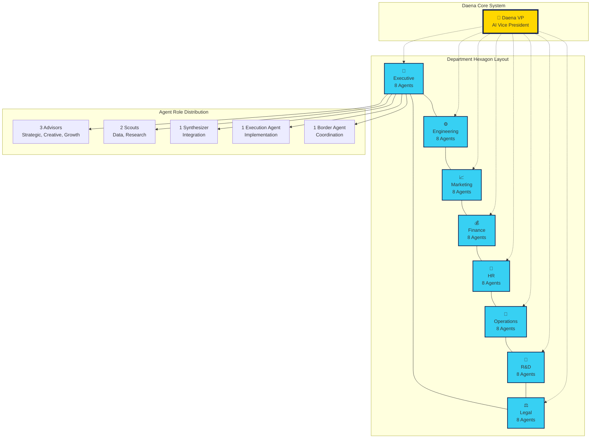

# Department Map - 8 Hexagonal Departments

## Daena AI VP System - Sunflower-Honeycomb Department Structure

## Department Overview

### Central Coordination
**🌻 Daena VP (AI Vice President)**
- Strategic oversight of all 8 departments
- Cross-department coordination and alignment  
- Executive decision support for the founder
- Real-time monitoring of 64 agents

### Department Structure (8 Hexagonal Units)

1. **👑 Executive Leadership (8 Agents)**
   - Strategic planning and corporate governance
   - Long-term vision and strategic alignment
   - Board relations and executive decision support

2. **⚙️ Engineering & Development (8 Agents)**
   - Software development and system architecture
   - Technical innovation and infrastructure
   - Quality assurance and DevOps operations

3. **📈 Marketing & Sales (8 Agents)**
   - Brand management and customer acquisition
   - Market analysis and competitive intelligence  
   - Sales operations and revenue generation

4. **💰 Finance & Accounting (8 Agents)**
   - Financial planning and budget management
   - Investment strategy and risk management
   - Accounting and financial reporting

5. **👥 Human Resources (8 Agents)**
   - Talent acquisition and employee development
   - Culture management and performance optimization
   - Benefits administration and employee relations

6. **🔧 Operations & Support (8 Agents)**
   - Business operations and process optimization
   - Customer support and service delivery
   - Supply chain and resource management

7. **🔬 Research & Development (8 Agents)**
   - Innovation research and product development
   - Technology scouting and competitive analysis
   - Experimental projects and future planning

8. **⚖️ Legal & Compliance (8 Agents)**
   - Legal affairs and regulatory compliance
   - Risk management and contract administration
   - Intellectual property and corporate governance

### Agent Role Categories (5 Per Department)

- **3 Advisors**: Strategic, Creative, and Growth advisory roles
- **2 Scouts**: Data Scout and Research Scout for intelligence gathering
- **1 Synthesizer**: Integration and coordination specialist
- **1 Execution Agent**: Implementation and delivery specialist  
- **1 Border Agent**: Cross-department communication and coordination

## Interconnection Pattern

- **Central Hub**: Daena VP coordinates all departments
- **Hexagonal Adjacency**: Each department connects to adjacent departments
- **Border Agent Network**: Facilitates cross-department collaboration
- **Council Governance**: 5 councils provide oversight across departments

**Total System Capacity: 64 AI Agents + 1 AI VP = 65 AI Entities**

**© MAS-AI — Confidential — Patent Pending** 