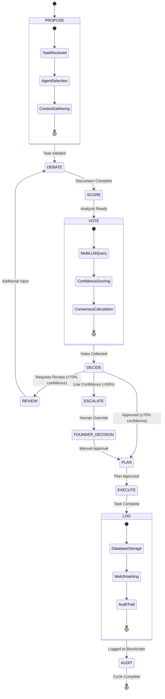

# Collaborative Multi-Agent Protocol (CMP) Lifecycle

## CMP State Machine for Decision-Making Process

## CMP Process Stages

### 1. PROPOSE Stage
- **Task Received**: New task or decision requirement enters system
- **Agent Selection**: Identify relevant agents and departments
- **Context Gathering**: Collect necessary background information

### 2. DEBATE Stage
- **Multi-agent discussion**: Relevant agents contribute perspectives
- **Information synthesis**: Combine different viewpoints
- **Issue clarification**: Ensure all aspects are considered

### 3. SCORE Stage
- **Analysis preparation**: Organize debate outcomes
- **Criteria establishment**: Define decision parameters
- **Readiness assessment**: Confirm voting prerequisites

### 4. VOTE Stage
- **Multi-LLM Query**: Query multiple AI models concurrently
- **Confidence Scoring**: Each model provides confidence rating
- **Consensus Calculation**: Aggregate votes and calculate consensus

### 5. DECIDE Stage
- **Threshold Analysis**: Compare confidence to required threshold (70%)
- **Decision Classification**: Approved, Review Required, or Escalation
- **Path Selection**: Route to appropriate next stage

### 6. PLAN Stage
- **Strategy Development**: Create implementation plan
- **Resource Allocation**: Assign agents and tools
- **Timeline Establishment**: Set milestones and deadlines

### 7. EXECUTE Stage
- **Implementation**: Carry out the approved plan
- **Progress Monitoring**: Track execution status
- **Quality Assurance**: Ensure standards are met

### 8. LOG Stage
- **Database Storage**: Record decision and execution details
- **Web3 Hashing**: Generate blockchain transaction hash
- **Audit Trail**: Create immutable record

## Patent-Worthy Innovations

1. **Confidence-Based Thresholds**: Automatic routing based on AI confidence scores
2. **Multi-LLM Consensus**: Parallel querying of multiple AI models for robust decisions
3. **Blockchain Integration**: Immutable audit trail for AI-driven decisions
4. **Escalation Protocols**: Automatic human override for low-confidence decisions
5. **State-Based Processing**: Formal state machine ensures consistent decision flow

**© MAS-AI — Confidential — Patent Pending** 