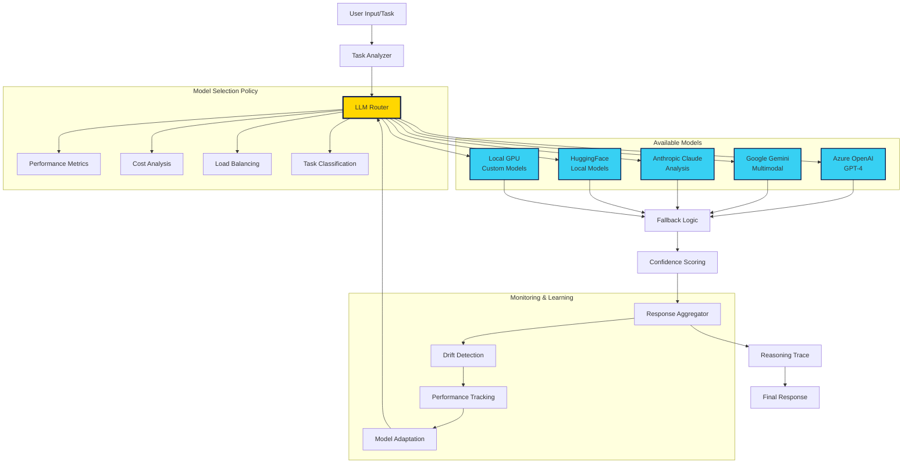

# Multi-LLM Routing Architecture

## Intelligent Model Selection and Fallback System

## Routing Components

### Task Analyzer
- **Input Classification**: Determines task type (creative, analytical, coding, etc.)
- **Context Extraction**: Identifies relevant context and requirements
- **Priority Assessment**: Evaluates urgency and importance

### Model Selection Policy
1. **Performance Metrics**: Historical accuracy and response quality
2. **Cost Analysis**: Token cost optimization across providers
3. **Load Balancing**: Distribute load across available models
4. **Task Classification**: Match model capabilities to task requirements

### Available Model Ecosystem
- **Azure OpenAI GPT-4**: Premium reasoning and general intelligence
- **Google Gemini**: Multimodal capabilities (text, image, video)
- **Anthropic Claude**: Detailed analysis and ethical reasoning
- **HuggingFace Models**: Open source specialized models
- **Local GPU Models**: Custom fine-tuned models for specific tasks

### Fallback & Resilience
- **Automatic Failover**: Switch to backup models on failure
- **Quality Assurance**: Validate response quality before delivery
- **Error Recovery**: Graceful degradation with alternative approaches

### Monitoring & Adaptation
- **Drift Detection**: Monitor model performance degradation
- **Performance Tracking**: Real-time metrics collection
- **Model Adaptation**: Continuous optimization of routing decisions

## Patent-Worthy Innovations

1. **Intelligent Task Classification**: Automatic routing based on task characteristics
2. **Multi-Provider Orchestration**: Seamless integration across different AI providers
3. **Cost-Performance Optimization**: Dynamic balancing of quality vs. cost
4. **Confidence-Aware Fallback**: Automatic model switching based on confidence scores
5. **Continuous Learning**: Self-improving routing based on historical performance
6. **Reasoning Trace**: Transparent decision-making process for audit and compliance

## Current Implementation Status

- ✅ **Basic Router**: Random selection implemented (`llm/switcher/llm_router.py`)
- 🔄 **TODO**: Sophisticated routing algorithms
- 🔄 **TODO**: Performance metrics tracking
- 🔄 **TODO**: Cost optimization
- 🔄 **TODO**: Drift detection

**© MAS-AI — Confidential — Patent Pending** 