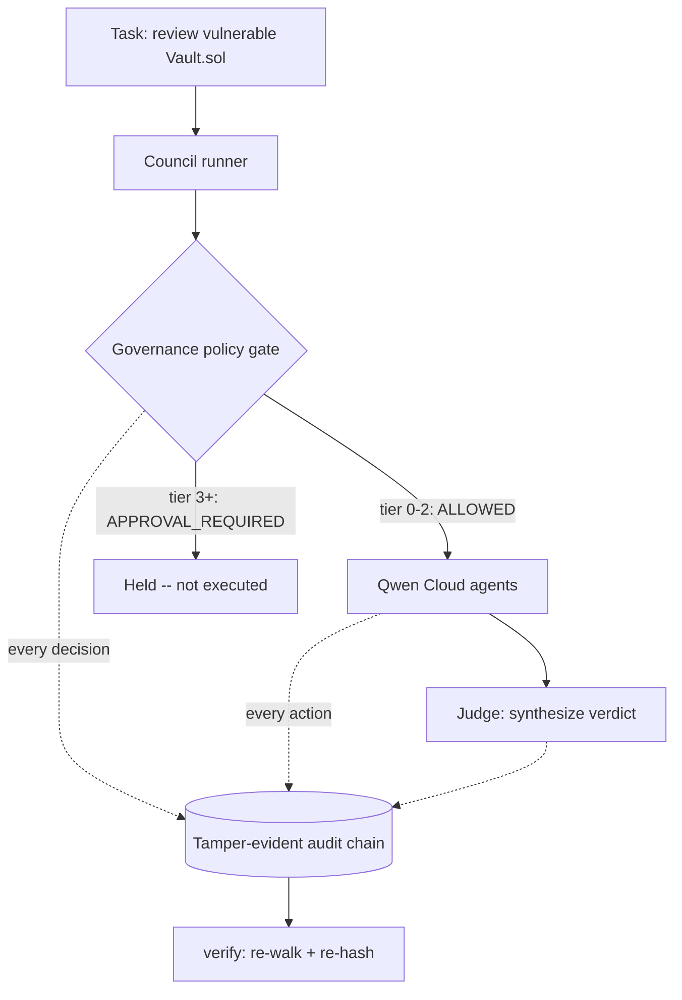

# Daena on Qwen Cloud -- a governed multi-agent system with a signed audit trail

Most multi-agent demos show **capability**. This one shows **accountability**:
every agent action passes a governance policy gate and is written to a
tamper-evident, hash-chained audit trail, running on Qwen Cloud models.

Built by [MAS-AI Technologies](https://mas-ai.co). The consensus topology
is patent-pending. This directory is the sanitized, dependency-free public
slice of Daena's governed pipeline -- no commercial config, no secrets,
Python stdlib only.

## The scenario

A high-stakes workflow where capability without accountability is dangerous:
a **smart-contract security review**. Four Qwen-backed agents review a
deliberately vulnerable Solidity `withdraw` (classic reentrancy):

| Agent      | Qwen model       | Action                | Governance tier        |
|------------|------------------|-----------------------|------------------------|
| ANALYST    | qwen-plus        | analyze contract      | 1 (logged)             |
| ADVERSARY  | qwen-max         | generate exploit PoC  | **4 (gated -- held)**  |
| AUDITOR    | qwen-turbo       | rank severity         | 1 (logged)             |
| JUDGE      | qwen-max         | synthesize verdict    | 1 (logged)             |

The ADVERSARY is asked to produce a working exploit. The governance gate
classifies that action Tier 4 (CRITICAL) and **withholds it pending human
approval** -- the model is perfectly capable, the system chooses not to.
The council still reaches a correct verdict without it.

## Run it (offline, no key, no spend)

```bash
cd hackathon/qwen
python run_demo.py --tamper
```

You will see the gate hold the exploit action, the synthesized verdict, the
audit trail verifying clean, and then a tamper attempt being detected.

```bash
python run_demo.py --mode UNLEASHED   # shield still gates the Tier 4 action
python run_demo.py --out result.json  # write the full result + audit trail
python -m pytest tests/               # 10 offline tests
```

## Run it live on Qwen Cloud (founder-gated)

Live mode makes real, paid calls to Qwen Cloud. Set the key first:

```bash
export QWEN_CLOUD_API_KEY=sk-...          # Alibaba Model Studio (DashScope)
export QWEN_CLOUD_BASE_URL=...            # optional: US / Beijing region
python run_demo.py --live
```

The same governance gate and audit chain wrap the live run; only the model
backend changes.

## Architecture



Three layers, one run:

1. **Council** -- heterogeneous Qwen models (`qwen-plus` / `qwen-max` /
   `qwen-turbo`) answer independently, then a judge synthesizes. A council
   that only ever agrees is not a council.
2. **Governance gate** (`policy_gate.py`) -- every action is classified into
   a tier and an outcome before it runs. Three modes (UNLEASHED / BALANCED /
   GOVERNED) trade autonomy for oversight; the asset shield is always on, so
   the Tier 4 exploit action is gated even in UNLEASHED.
3. **Signed audit trail** (`audit_chain.py`) -- every decision is appended to
   a SHA-256 hash chain: `entry_hash = sha256(actor | action | result |
   prev_hash | timestamp)`. This is the **same payload format Daena uses in
   production** (`backend/app/services/audit.py`), so a trail produced here
   verifies under the same rules. Mutate, reorder, or drop any entry and
   `verify()` localizes the break.

## Why it wins

Production AI does not just need to act -- it needs to prove what it did and
why. This demo is the accountability layer: governed action plus a signed,
tamper-evident record, on Qwen Cloud. The differentiator is the audit trail
and the gate, not the model call.

## Files

```
hackathon/qwen/
  run_demo.py                 CLI entry (replay default, --live, --tamper)
  daena_qwen_demo/
    audit_chain.py            tamper-evident hash chain (sign + verify)
    policy_gate.py            governance tier + mode evaluation
    qwen_client.py            live (DashScope) + replay clients
    scenario.py               the vulnerable contract + agent roster
    runner.py                 orchestrates council + gate + audit
  fixtures/replay.json        recorded responses (deterministic offline run)
  tests/test_demo.py          10 offline tests
```

## Status / submission gate

This is preparation, not a submission. The actual Devpost entry, the public
repo contents, and any live-mode spend are **founder-gated** (MAS-AI). See
`Doc/company-ops/applications/QWEN_HACKATHON_BRIEF.md`.
